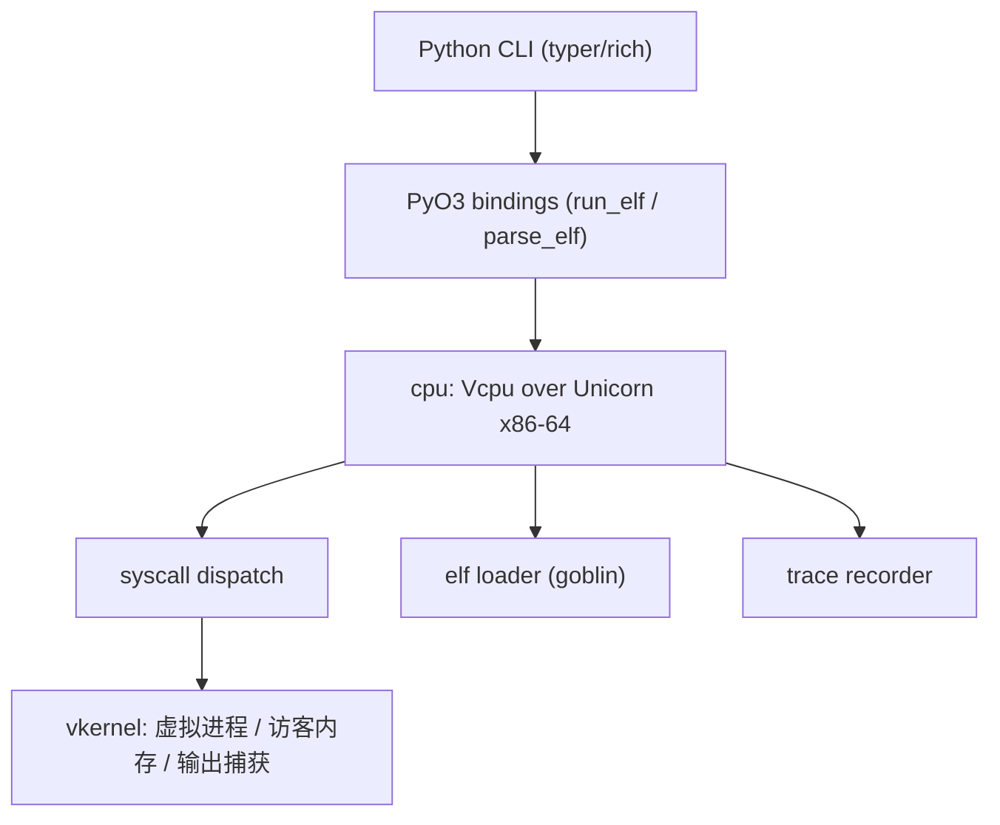

> 一个基于 Unicorn 的 pwntools 兼容层，无需 WSL、虚拟机或 Docker。
> 本文基于 winVpwn 0.1.0（Stage 1）的落地实现，全部代码与测试均可在
> https://github.com/TSVMV/winVpwn 复现，包已在 PyPI 发布：`pip install winvpwn`。

## 为什么会有这个东西

pwn / CTF 分析场景里，最顺手的工具链（pwntools、checksec、各类 ELF 分析脚本）几乎
都是 Linux 原生的。Windows 上的研究者要么开一台虚拟机，要么启用 WSL，要么常年在
Docker 里折腾。这些方案解决的是"环境隔离"，代价却是三样东西：启动慢、内存大、
文件系统跨域麻烦。

winVpwn 换了一条路：**不做环境，做兼容层**。它把 Linux ELF 二进制加载进一个进程内的
CPU 模拟器（Unicorn Engine），把 Linux 系统调用翻译成虚拟内核调用，对外暴露一个
"虚拟进程 + 虚拟文件描述符 + 虚拟文件系统"。整个过程不需要任何 hypervisor 层，
宿主系统几乎无感。

```
传统路线                     winVpwn 路线
┌──────────────┐            ┌──────────────────┐
│ Windows 主机  │            │ Windows 主机      │
│  ┌──────────┐ │            │  ┌─────────────┐ │
│  │ WSL/VM   │ │            │  │ Unicorn 沙箱 │ │
│  │  Linux ELF│ │            │  │  Linux ELF  │ │
│  └──────────┘ │            │  └─────────────┘ │
└──────────────┘            └──────────────────┘
   内核级隔离，重                 进程内模拟，轻
```

## 设计目标与边界

Stage 1 刻意收敛，目标非常具体：

- 加载并运行**静态 `ET_EXEC` x86_64** ELF
- 只需要 `write` / `exit` / `exit_group` 三个系统调用就能跑通
- 所有 I/O 都在虚拟空间完成，**不触碰宿主文件系统与网络**
- 提供干净的 Python API 和 CLI，方便后续叠加 pwntools 语义

这不是一个"什么都能跑的模拟器"，而是一个**可以逐步扩大系统调用覆盖面的内核模拟
框架**。Stage 1 先把最小可执行路径做扎实，为 Stage 2 的 `read` / `open` / `mmap` 等
高频调用铺路。

## 架构：五层结构



各层职责单一：`elf` 负责解析与校验镜像，`cpu` 负责模拟执行循环，`syscall` 负责
Linux ABI 到虚拟内核的翻译，`vkernel` 维护进程上下文，`memory` 做访客地址空间的
簿记与重叠检测。

## 1. ELF 加载器：把"能跑"做成"必须严谨"

加载器基于 goblin 解析，但真正的价值在**校验**。每一处可能的畸形输入都对应一个
稳定、可机器读取的错误码：

| code | 含义 |
| ---- | ---- |
| E001 | 不是 ELF（魔数错误） |
| E002 | 不支持的镜像格式（如 32 位） |
| E003 | 不支持的机器类型（Stage 1 仅 x86_64） |
| E004 | 不支持的 ELF 类型（如 Stage 1 的 PIE / ET_DYN） |
| E005 | 程序头畸形 |
| E006 | 镜像被截断（段超出文件范围） |
| E007 | 可加载段在访客地址空间重叠 |

加载器依次检查：ELF 魔数 → 64 位小端 → 机器类型 → ELF 类型 → 每个 `PT_LOAD`
段的文件范围合法性 → 段之间是否重叠。任何一个检查不通过，都会得到带错误码的
明确失败，而不是模拟器里的 undefined behavior。

```rust
pub fn load_elf(image: &[u8]) -> Result<LoadedElf, ElfError> {
    // E001: 魔数检查
    if image.len() < 4 || &image[..4] != b"\x7fELF" {
        return Err(ElfError::NotElf);
    }
    // E002/E003/E004: 格式、机器、类型检查
    // ...
    // E006: 每个 PT_LOAD 段必须完全落在文件字节内
    // E007: 段之间不允许重叠
    Ok(LoadedElf { entry, segments, is_pie })
}
```

输出是一个 `LoadedElf`：入口点 + 所有 `PT_LOAD` 段（虚拟地址、内存大小、文件大小、
权限位、对齐）。`memsz > filesz` 的尾部按惯例作为零填充的 `.bss` 处理。

## 2. CPU 模拟：Unicorn 之上的 Vcpu

`cpu::unicorn_engine::Vcpu` 封装一个 Unicorn x86-64 引擎，做三件事：

1. **映射段**：把每个 `PT_LOAD` 段按页对齐映射进访客空间，ELF 权限位（`R/W/X`）
   翻译成 Unicorn 的 `Prot`，`.bss` 尾部零填充。
2. **搭栈**：映射一块访客栈，并安装 Linux 风格的初始栈布局 —— RSP 处是 `argc`，
   随后是空终止的 `argv` 数组、`envp` 数组和 `auxv`。Stage 1 用 `argc = 0`，
   即四个清零的 qword：
   ```
   RSP        -> argc = 0
   RSP + 0x08 -> argv[0] = NULL
   RSP + 0x10 -> envp[0] = NULL
   RSP + 0x18 -> auxv[0] = AT_NULL
   ```
3. **挂 syscall 钩子**：核心机制。在 `syscall` 指令上注册一个 `add_insn_sys_hook`，
   指令执行到这一步时，读取 Linux x86_64 系统调用 ABI 寄存器（`rax` 为调用号，
   `rdi/rsi/rdx/r10/r8/r9` 为六个参数），构造 `SyscallRegs`，交给调度器；随后把
   返回值写回 `rax`。

```rust
uc.add_insn_sys_hook(X86Insn::SYSCALL, 1, 0, move |uc| {
    let rax = uc.reg_read(RegisterX86::RAX).unwrap_or(0) as i64; // 调用号
    let args = [
        uc.reg_read(RegisterX86::RDI).unwrap_or(0),
        uc.reg_read(RegisterX86::RSI).unwrap_or(0),
        uc.reg_read(RegisterX86::RDX).unwrap_or(0),
        uc.reg_read(RegisterX86::R10).unwrap_or(0),
        uc.reg_read(RegisterX86::R8).unwrap_or(0),
        uc.reg_read(RegisterX86::R9).unwrap_or(0),
    ];
    let regs = SyscallRegs::from_regs(rax, args, rip);
    // ... dispatch，并把 ret 写回 RAX
});
```

执行循环的终止条件有三条：进程通过 `exit` 主动退出、执行流落到未映射页
（falloff，正常路径，返回触发位置 RIP）、或超时。Unicorn 的报错信息按
`READ_PROTECT / FETCH_UNMAPPED` 等类别分类，把它们归一为清晰的 `ExitReason`。

## 3. Syscall 翻译：Linux ABI -> 虚拟内核

`syscall::Dispatch` 用一张可注册的表做路由。每个 handler 实现 `SyscallHandler`
trait，声明自己负责的调用号、名字和实现。Stage 1 的表格：

| nr | name | 行为 |
| -- | ---- | ---- |
| 1 | `write` | 捕获进虚拟进程的输出缓冲区 |
| 60 | `exit` | 记录退出码并停止模拟 |
| 231 | `exit_group` | 单线程下等同 `exit` |
| * | 未实现 | 返回 `-ENOSYS` 并记入 trace |

关键设计：**`write` 永远不会碰宿主文件描述符**。字节被追加到由虚拟进程持有的
内存输出缓冲区里，运行结束后通过 `vcpu.output()` 取回。这是"沙箱"属性的根本
来源 —— 没有把任何访客数据转发到宿主 I/O 层。

未知调用号返回 `-ENOSYS`（errno 语义），并且每次 dispatch 都会记录一条 trace：
调用号、名字、六个参数、返回值、触发地址。这份 trace 既用于测试断言，也是将来
做执行回放 / 行为分析的基础设施。

## 4. 虚拟内核：进程上下文与访客内存

`vkernel` 层定义每个系统调用的视角：

- **进程状态**：`Running` / `Exited { code }`，跟踪生命周期。
- **访客内存后端**：抽象出 `GuestMemory`，测试环境用内存实现，执行环境用
  Unicorn 驱动的 `UnicornGuest`。handler 只面向这个抽象，不直接碰 Unicorn API，
  因此可以独立单元测试。
- **输出捕获**：合并 stdout/stderr 语义的 `OutputCapture`。

`memory::mmap::MemoryMap` 负责访客地址空间的簿记，插入区域即检测重叠（错误
E101）。它**纯属访客空间记账**，不授予任何宿主访问能力 —— 这是隔离边界的一环。

## 5. Python 侧：PyO3 绑定与 CLI

Rust 引擎通过 PyO3 暴露给 Python，扩展模块名 `winvpwn._core`，对外两个函数：

- `run_elf(image, timeout_ms=0)`：加载、映射并执行，返回一个字典
  （退出原因、退出码或 falloff RIP、捕获输出、syscall trace）。
- `parse_elf(image)`：只解析不执行，返回入口点、PIE 标志和可加载段列表。

Python 包层面，CLI 用 Typer + Rich 实现，提供六个命令：

```console
$ winvpwn doctor                 # 环境自检：版本、原生引擎、Python、平台、工具链
$ winvpwn run hello_static       # 在模拟器中运行静态 ELF
hello, winVpwn
$ winvpwn elf hello_static       # 解析 ELF，展示入口点与可加载段
$ winvpwn asm 'mov rax, 1'       # 基于 Keystone 汇编
$ winvpwn disasm 48c7c001000000  # 基于 Capstone 反汇编
$ winvpwn version
```

Python 侧的工程规格同样严格：mypy `--strict`、ruff 全部规则档、typer/rich 依赖
有明确版本区间。CLI 每个命令都支持 `--json` 输出，方便脚本化。

## 工程与发布：一条可复制的 Rust+Python 链路

Stage 1 交付的不只是功能，还有一套完整的工程基建：

- **测试**：30 个 Rust 单元测试 + 17 个 Python 单元/CLI 测试。覆盖加载器校验
  （魔数、截断、PIE 拒绝、权限映射）、栈布局、falloff 路径、errno 语义、CLI
  输出。`filterwarnings = ["error"]` 把警告直接当成测试失败。
- **质量门禁**：CI 里 clippy `-D warnings`、rustfmt、ruff、mypy `--strict` 全开，
  覆盖率要求 ≥ 80%（当前 80.61%）。
- **发布产物**：借助 maturin 的 `abi3` 能力，构建 CPython 3.11+ 通用 wheel ——
  一个 `cp311-abi3` 的 Windows wheel 同时服务 3.11/3.12/3.13。发布走 GitHub
  Actions 矩阵构建（Windows MSVC + Linux），PyPI 通过 trusted publishing 自动上传，
  已发布 `winvpwn 0.1.0`（`win_amd64` + `manylinux_2_34_x86_64` 两个 wheel）。

## 使用边界

winVpwn 面向**授权环境**：CTF 题目、教学、以及你自己拥有的软件。它不触碰宿主
文件系统与网络（除非显式映射），每个模拟进程的运行权限都不高于宿主进程。这使它
适合在 Windows 上做只读式分析、动态观察和教学演示。

## Stage 2 的方向

当前基础设施已经把"执行循环 + syscall 翻译 + trace 记录"这条主轴打通。接下来
自然的扩展顺序：

1. **I/O 类调用**：`read` / `open` / `close` / `lseek`，配合一个可插拔的虚拟
   文件系统（宿主文件需显式映射才能访问）。
2. **`mmap` / `munmap`**：动态内存管理，解锁依赖堆分配的二进制。
3. **信号与 `brk`**：逼近真实进程语义，覆盖更多 libc 场景。
4. **PIE / 动态链接**：支持 `ET_DYN` 与解释器，让非静态二进制也能跑。
5. **trace 消费层**：把 Stage 1 记录的 syscall trace 升级为执行回放与行为分析工具。

## 结语

winVpwn 的定位很明确：**一个在 Windows 上原生、进程内、可逐步扩展的 Linux ELF
运行环境**。它用一个最小但严谨的 Stage 1 验证了架构 —— 稳定的错误码、清晰的五层
划分、完全虚拟化的 I/O —— 让后续的系统调用覆盖变成纯粹的增量工作。

仓库：https://github.com/TSVMV/winVpwn
文档：`docs/architecture.md` · `docs/compatibility.md` · `docs/security.md`
包：`pip install winvpwn`
